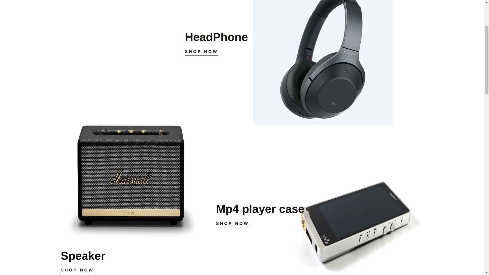
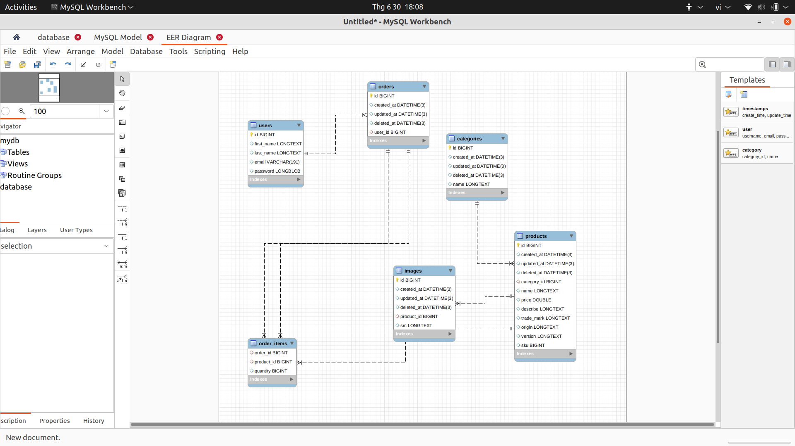

#OCG project


## I. Folder client chứa code Vue3.(Melody-shop-fronend)

- Các bước để chạy client:

1. cd Melody-shop-fronent folder.
2. npm install để cài dependences.
3. npm serve để chạy ứng dụng.

- /public: chứa cái file public.
- /src: chứa toàn bộ source code.
- /assets: chứa các file tĩnh.
- /components: chứa toàn bộ components.
- /views: chứa các pages của ứng dụng.
- /routes: cấu hình router.
- /store: store vuex
- /service: call api

## II. Folder server chứa code GOLANG(Melody-shop-backend)

Cấu trúc thư mục backend:

- /controller: chứa các logic bussiness.
- /models: định nghĩa các model database.
- /routes: chứa các cấu hình router.
- /go.mod: chứa danh sách dependences.
- /app.go: chứa file app.
- /middlewares:xử lý middlewares

Frontend chạy trên cổng :8080 <br>
Backend chạy trên công :3000

### III. API

1. "/api/product"

```
 ├── Get "/" "?&category=&sort=&order=q="
 ├── Post "/"
 ├── Get "/:id"
 ├── Delete "/:id"
 └── Patch "/"
```

2. "/api/category"

```
 ├── Get "/"
 ├── Post "/:id"
```

3. "/api/image"
   ```
   ├── Get "/"
   ├── Post "/:id"
   ```
4. "/api/authen"
   ```
   ├── Post "/register"
   ├── Post "/login"
   ```

## IV. Database


